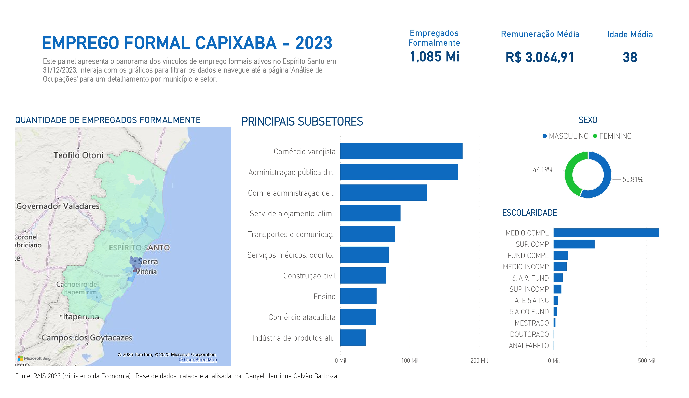
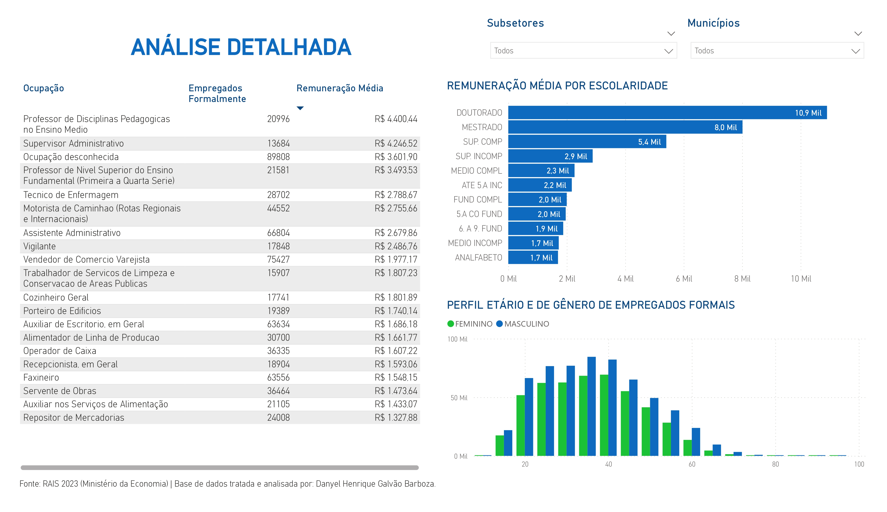

# Dashboard de Análise de Empregos Formais - RAIS 2023 (Espírito Santo)

Este projeto apresenta uma análise ponta-a-ponta (*end-to-end*) dos microdados da **Relação Anual de Informações Sociais (RAIS)** de 2023, com foco no estado do **Espírito Santo**.  
O objetivo foi transformar dados brutos e complexos em um **dashboard interativo no Power BI**, capaz de gerar *insights* sobre o perfil de empregos, ocupações e remunerações por município e setor econômico.

> Projeto desenvolvido como um **case de portfólio** para demonstrar habilidades em **ETL (Extract, Transform, Load)**, **análise de dados** e **visualização de dados**.

---

## O Dashboard (Resultados)

O painel é dividido em **duas páginas**, seguindo uma narrativa “**macro → micro**”:

### **Página 1 – Panorama Geral**
Visão geral do panorama de empregos formais no estado, respondendo:  
> “Qual é a fotografia do emprego no Espírito Santo?”

---

### **Página 2 – Análise de Ocupações**
Ferramenta de *drill-down* que permite explorar dados por município e setor, respondendo:  
> “Quais são as profissões mais relevantes e seus salários em uma cidade ou setor específico?”

---

## Ferramentas e Tecnologias Utilizadas

| Ferramenta | Função |
|-------------|--------|
| **Python** | Linguagem principal para o processo de ETL |
| **Pandas** | Manipulação, limpeza e enriquecimento dos dados |
| **Jupyter Notebook** | Desenvolvimento e documentação dos scripts de ETL |
| **Power BI** | Modelagem, criação de medidas DAX e visualização interativa |
| **DAX** | Cálculos personalizados, como médias salariais ajustadas |

---

## Como Utilizar o Projeto

1. **Dados Brutos (Fonte)**  
   Os dados originais da RAIS (`ES2023.txt` e dicionários) **não estão incluídos** neste repositório devido ao tamanho.  
   Podem ser baixados no [portal oficial do governo](https://www.rais.gov.br/sitio/index.jsf).

2. **Execução do ETL**  
   - Coloque os dados brutos na pasta `ETL/`.  
   - Execute, em sequência:  
     1. `es2023_tratamento.ipynb`  
     2. `preparar_csv_powerbi.ipynb`  
   - O processo gera o arquivo `rais_es_pronta_para_bi_FINAL.csv`.

3. **Visualização**  
   - Abra o dashboard no **Power BI Desktop**: `dashboard_empregos_es.pbix`.  
   - Alternativamente, consulte a versão em PDF (`dashboard_empregos_es.pdf`).

---

 **Autor:** Danyel Barboza  
 **Ano:** 2025  
 **Tema:** Emprego Formal no Espírito Santo (RAIS 2023)
